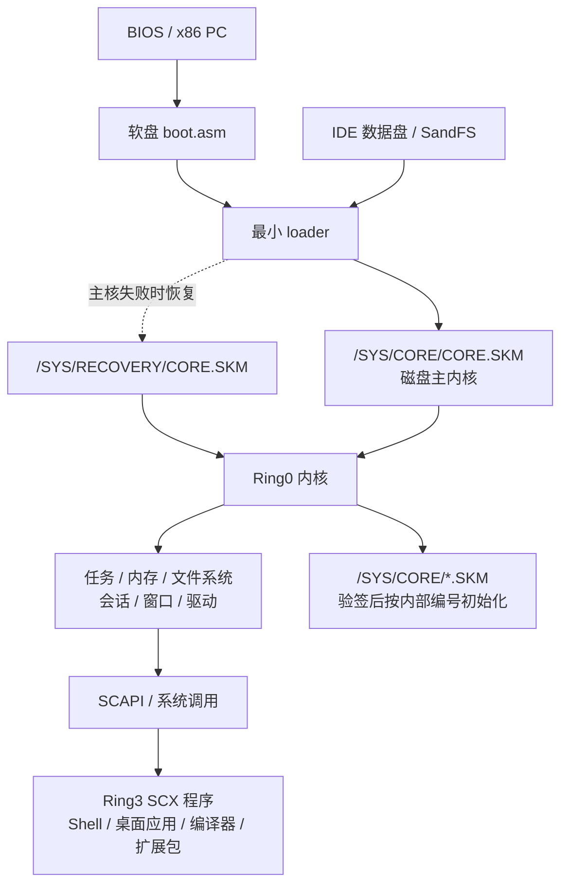
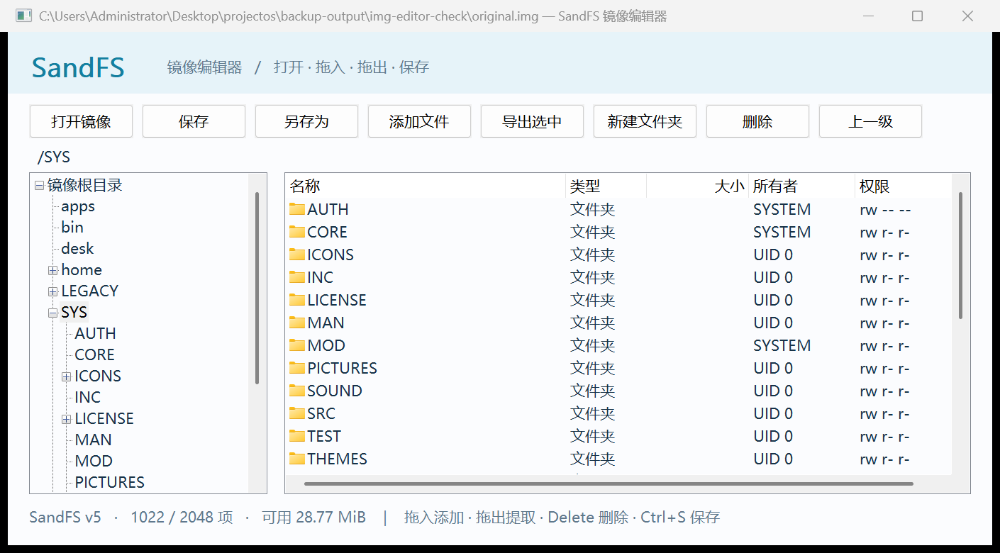

# SandCore / 沙核

> 🌐 **Language / 语言：** 简体中文（当前） | [English README →](README_EN.md)

**从引导器、内核到桌面和原生开发工具的 32 位 x86 操作系统。**

SandCore 由 [mio](https://github.com/mio-qwq/) 开发。工程包含 BIOS 引导、分页与抢占式多任务、SandFS 文件系统、多用户桌面、图形应用、音频、IPv4 网络、自有可执行格式，以及可以在系统内编译和运行程序的 C 编译器、汇编器和调试器。

当前开发版本为 **M10a1**，已于 **2026-10-07 验收通过**。按最新发布决定，M10a1 作为 M10a 的 **GitHub Preview 预发布版**交付，后续统一在 `main` 开发；M9 是已验收的正式发布版本，M8a 与更早版本保留源码和运行镜像。完整 M10 尚未宣布完成，基础内核尚未冻结。

> **关于 AI 参与与文档质量：** 本项目包含由 AI 生成或辅助编写的代码，部分文档也由 Agent 撰写或整理，因此可能存在表述不清、人称或代词指代错误，以及遗留的 Agent 自述等问题。欢迎通过 [Issues](https://github.com/mio-qwq/SandCore/issues) 指出问题；我也会在后续持续校对与完善。

| 入口 | 内容 |
|---|---|
| [当前开发验收](sandcore/docs/M10A1-ACCEPTANCE.md) | M10a1 功能、运行方法、实际证据和限制 |
| [M10a1 Preview 下载](https://github.com/mio-qwq/SandCore/releases/tag/M10a1) | 已验收的开发运行包；[发布说明](sandcore/docs/M10A1-PREVIEW.md) |
| [构建与运行](#构建与运行) | 从源码构建当前系统、启动已有版本 |
| [架构](#系统架构) | 启动链、内核、用户态、会话和扩展 |
| [目录](#项目目录) | 主工程、扩展包、镜像编辑器和历史档案 |
| [扩展软件包](#扩展软件包-ext) | 五个应用、共享库、自包含 SCX 安装器 |
| [SandFS 镜像编辑器](#sandfs-镜像编辑器) | Windows 上浏览、导入导出和编辑数据盘 |
| [文档索引](#文档索引) | 按主题查阅设计、格式、工具和验收文档 |
| [历史版本](releases/README.md) | M6 / M7 / M8a / M9 精简运行包 |

## 当前能力

| 领域 | 已实现的范围 |
|---|---|
| 启动与内核 | BIOS 双盘启动、磁盘主内核、最小 loader、恢复副本、分离的零环扩展 |
| 内存与任务 | 物理页与堆管理、每任务独立地址空间、抢占调度、事件等待、动态任务与关联资源、退出和异常回收 |
| 用户与权限 | 内核 UID/GID、文件读写权限、登录会话、各会话独立桌面、独立焦点与输入 |
| 图形桌面 | VGA 回退、原生真彩与多分辨率、Aurora / Classic 主题、窗口管理、桌面菜单与快捷方式、客户区截图 |
| 文字 | 直接加载凤凰 12px / 16px 原始 TTF，整数/定点解析与栅格化、按需字形缓存；Notes 可显示中文源码注释 |
| 存储 | 自有 SandFS，当前 v5 权限与对象代数、双目录 bank、CRC 与 COW 事务；M10a1 开发盘 256MiB，保留旧卷兼容 |
| 音频 | Windows QEMU AC97、系统提示音、WAV / MP3 / FLAC 播放、封面、迷你播放器与命令行入口 |
| 网络 | Windows QEMU e1000、IPv4、Ethernet / ARP / ICMP / UDP / TCP、分片与重组、路由、DHCP、DNS 和 socket |
| 命令行 | SandShell、管道与重定向、作业、独立 CLI 工具、自写 nano，以及网络工具 |
| 原生开发 | S3C / SCCC C 编译器、SandAsm 汇编器、图形与 CLI 调试入口、SCX 打包与 SKM 扩展开发 |
| 管理与调试 | 外部双串口 SYSTEM 管理、COM1 零环调试；客体 root 与外部硬件管理资格分离 |
| 扩展生态 | 独立用户态共享库 libex、五应用软件包、安装/卸载向导、内嵌图标与配置模板 |
| 宿主工具 | Windows SandFS 镜像编辑器、构建/镜像/打包工具、串口管理工具、历史重建与验证脚本 |

取消固定多任务上限是 M10a1 的重点：任务、凭据、环境、调试/SIMD 状态及关联会话、窗口、管道等按实际资源动态分配。数量最终受可用内存和各项资源合同约束，分配失败明确返回并回滚；具体生命周期见 [M10-LIFECYCLE.md](sandcore/docs/M10-LIFECYCLE.md)。

内置图形应用包括 Files、Notes、Canvas、Lens、Settings、Monitor、IDE、Debug 等。内置游戏、通用图形库与影片工程也保留在仓库中；其中原完整 M8 未达成的性能、画质和成片目标已封存，具体范围见 [M8-FROZEN.md](sandcore/docs/M8-FROZEN.md)。

### 网络工具与范围

当前提供 **19 个独立网络工具**：

```text
ip          ifconfig       ifup         ifdown       route
arp         arping         ping         traceroute   netstat
nslookup    hostname       dnsdomainname ipcalc       udhcpc
nc          wget           tftp         curl
```

`nc` 包含 `-e` 执行程序并连接标准流的功能。`wget` 和自写 `curl` 支持文档列出的 HTTP 子集；`curl` 包含请求方法、请求头、上传、重定向和文件输出等常用操作。具体选项以 [CLI-M10.md](sandcore/docs/CLI-M10.md) 为准。

原首批 18 个工具对应保留的 55 项网络参考表，`curl` 单独追加。M9 的 CLI 对照也按公开支持子集记录；命令数量与行为范围见相应矩阵。这里的工具是自写独立程序，BusyBox 用于功能对照。

当前网络设备目标是 **Windows QEMU 的 e1000 / Intel 82540EM**，接口名 `en0`。本轮只支持 IPv4，尚未实现 HTTPS/TLS、IPv6 和浏览器，也未宣称其它网卡或真实硬件的完整兼容性。

## 系统架构

### 启动链与磁盘主内核



系统仍采用两块盘：1.44MiB 软盘保存引导与最小 loader，IDE 数据盘保存 SandFS、主内核、程序、字体、配置和用户数据。几乎全部内核逻辑位于 `/SYS/CORE/CORE.SKM`；loader 只负责必要的只读磁盘定位、格式/边界与完整性检查、装载、交接和早期诊断。

主核无法装载时尝试 `/SYS/RECOVERY/CORE.SKM`。恢复目录与启动扩展目录分开；主内核的 CRC/SHA256 完整性检查和扩展的 Ed25519 签名验证是不同合同。

`/SYS/CORE/` 下除 `CORE.SKM` 外的 SKM2 扩展须通过正式公钥验签，再按受签名保护的内部唯一编号升序初始化一次。重复编号拒绝全部冲突项；成功注册的服务可常驻到重启。本轮不支持热卸载或热重载。旧 `/SYS/MOD` 的 SKM1 管理链路保留，格式说明见 [CORE.md](sandcore/docs/CORE.md) 和 [MODULE.md](sandcore/docs/MODULE.md)。

### 内核模块与用户态边界

| 层次 | 主要源码 | 职责 |
|---|---|---|
| 启动与装载 | `boot/boot.asm`、`boot/loader.c`、`kernel/core_entry.asm` | BIOS 入口、最小装载器、主核交接 |
| 内存与执行 | `memory.*`、`heap.*`、`paging.*`、`task.*`、`task_store.*`、`process.*` | 页与堆、地址空间、动态任务、调度和生命周期 |
| 身份与会话 | `auth.*`、`session.*`、`management.*` | UID/GID、凭据、登录、会话隔离与外部管理 |
| 文件与标准流 | `ata.*`、`fs.*`、`streams.*` | ATA、SandFS、事务、端点、管道和作业 |
| 图形与输入 | `gfx.*`、`display.*`、`wm.*`、`desktop.*`、`theme.*`、`ttf.*` | 显示、合成、窗口、桌面、主题、文字；键盘/鼠标由对应驱动接入 |
| 音频与网络 | `audio.*`、`e1000.*`、`network.*`、`net_socket.c`、`net_port/` | AC97、网卡、lwIP 适配、协议与 socket 生命周期 |
| 扩展与调试 | `module2.c`、`core_signature.*`、`serial.*`、`ringdebug.*`、`simd.*` | SKM、验签、双串口、调试、扩展寄存器状态 |
| 用户态 | `user/`、`ext/` | Shell、应用、开发工具、独立命令和软件包 |

内核以 freestanding C 和 x86 汇编编写，禁用浮点与 libc。用户程序通过自有系统调用和 [`SCAPI.H`](sandcore/user/SCAPI.H) 访问内核，通常由 `start.asm`、用户链接脚本和 SCX 封装链生成。已发布 API/ABI 只增不减；旧入口与缓冲布局保留，新能力使用新调用或版本化快照。

NUI 和各类 `SC*.H` / `*.inc` 提供原生界面、内存、标准流、网络等用户态工具层。S3C/SCCC 可以在客体内生成可运行机器码；宿主工具链承担启动、自举和指定组件的构建。宿主构建结果、系统内编译结果和实际运行证据分别记录。

### 会话、桌面与管理

每个登录会话拥有独立桌面、窗口、焦点和输入。SYSTEM 管理窗口默认不会出现在 mio 或 root 的桌面。隐藏会话不参与合成和绘制，内置 GUI 按可见性停止生成隐藏画面；网络、音频和 CLI 等后台任务仍继续，切回后请求重画。

外部双串口采用硬件调试模型：QEMU 宿主模拟另一台接线机器。客体普通用户和 root 不能通过自连串口取得 SYSTEM 管理资格。会话和权限的具体合同见 [SESSION.md](sandcore/docs/SESSION.md)、[AUTH.md](sandcore/docs/AUTH.md)、[SERIAL.md](sandcore/docs/SERIAL.md)。

### 数据盘中的主要路径

| 客体路径 | 用途 |
|---|---|
| `/SYS/CORE/CORE.SKM` | 主内核 |
| `/SYS/CORE/*.SKM` | 经过签名授权的开机扩展 |
| `/SYS/RECOVERY/CORE.SKM` | 独立恢复主核 |
| `/SYS/MOD/` | 旧 SKM1 管理扩展，按外部 SYSTEM 权限链操作 |
| `/SYS/FONT/` | 原始凤凰 TTF 与相关字体资源 |
| `/SYS/INC/`、`/SYS/SRC/` | 系统内开发所需公共头与源码 |
| `/SYS/MAN/`、`/SYS/TEST/` | 随盘说明与验证源码 |
| `/SYS/LICENSE/` | 引入的第三方源码、完整许可证、版权及来源记录 |
| `/BIN/`、`/APPS/`、`/DESK/` | 命令、图形应用与桌面快捷方式 |
| `/HOME/`、`/TMP/`、`/LEGACY/` | 用户文件、临时内容与兼容归档 |

## 项目目录

下面列出仓库的主要工程结构；`build/` 和本机备份另作说明。

```text
projectos/
├── README.md                    项目总介绍与导航
├── DEVELOPMENT-LOG.md           原根 README，开发阶段与验收沿革
├── AGENTS.md                    工作区工程、兼容、许可与流程约束
├── HANDOFF.md                   开发接力与内部状态记录
├── AUDIT-NOTES.md               历史审阅笔记
├── M8_GOAL.md                   原 M8 目标记录
├── build.bat                    当前系统构建入口，默认 M10a1
├── build-version.bat            历史源码快照重建入口
├── run-m10a1.bat                 当前开发验收版本运行入口
├── vonwaon-bitmap.ttf.zip        原始凤凰字体归档
│
├── sandcore/                    操作系统主工程
│   ├── boot/                    BIOS 引导与最小 loader
│   ├── kernel/                  内核、驱动、文件系统、桌面与系统调用
│   │   └── net_port/            lwIP 的 SandCore 平台适配
│   ├── user/                    原生用户程序、公共 API、UI 与开发工具
│   │   ├── m9/                 独立 CLI、nano、命令行开发工具
│   │   ├── net/                19 个网络工具及共享 HTTP/CLI 代码
│   │   ├── audio/              播放器与音频解码适配
│   │   ├── codec/              图片解码/服务适配
│   │   ├── compress/           DEFLATE 等压缩适配
│   │   └── pack/               bzip2 / LZMA 等归档组件
│   ├── modules/                 壁纸模块源码与已签扩展
│   │   └── signed/             已接收的签名公开产物
│   ├── assets/                  字体、图标、壁纸、声音/配置等资源
│   │   ├── design/             设计资料
│   │   ├── font/               字体构建输入与缓存资源
│   │   ├── trust/              正式验签公钥及说明
│   │   └── licenses/           资源许可证原文
│   ├── third_party/             固定第三方源码、来源、许可与摘要清单
│   ├── legacy/                  保留的历史程序及兼容资源
│   ├── docs/                    设计、格式、能力范围、验收与历史文档
│   ├── tests/                   客体探针与专项检查源码
│   ├── tools/                   构建、镜像、签名接收、串口与验证工具
│   ├── Makefile                 主构建规则
│   ├── m9.mk / m10.mk           里程碑构建与资源接线
│   ├── core.ld / linker.ld      主核及历史内核链接布局
│   └── build/                  本机镜像、生成文件与验收输出，不上传
│
├── ext/                         独立用户态扩展生态
│   ├── README.md                扩展工作区总览
│   ├── CONVENTIONS.md           扩展开发与交付约定
│   ├── libex/                   共享表达式、CSV、配置、音频与附加控件
│   ├── tools/                   图标、载荷与 SCX 封装工具
│   ├── SoftwarePack1/           第一套扩展软件包
│   │   ├── pcalc/              程序员计算器
│   │   ├── sheet/              电子表格
│   │   ├── hexed/              十六进制编辑器
│   │   ├── blocks/             方块游戏
│   │   ├── raider/             第一人称射击游戏
│   │   ├── installer/          安装/卸载向导与冻结载荷
│   │   ├── common/             统一身份与 About 页面
│   │   ├── icons/ / cfg/       像素图标、默认配置
│   │   ├── tests/ / tools/     宿主回归与包专用工具
│   │   ├── dist/               正式单文件 SCX 安装包
│   │   └── build/              本机构建输出；Git保留已有日志/预览
│   └── SoftwarePack1-baseline-20261006/
│                               原基线与署名前验收产物
│
├── sanddata_editor/             独立 C/Win32 SandFS 镜像编辑器
│   ├── src/ / resources/        程序源码、Win32 资源与 manifest
│   ├── docs/ / tests/           使用截图与检查源码
│   ├── sanddata_editor.exe      已发布的 M9 版本 EXE
│   ├── build.bat                编辑器独立构建入口
│   └── build/                  本机 M10a1 EXE 与中间输出，不上传
│
├── snapshots/                   M6a / M6 / M7 / M8a 历史源码快照
├── releases/                    M6 / M7 / M8a / M9 每版一份运行包
│   ├── MANIFEST.json            包与文件来源、尺寸及摘要
│   └── SHA256SUMS.txt            发布包摘要表
└── history/                     按内容去重的历史源码与工程输入
    ├── INDEX.json               原路径、保存位置、尺寸及摘要索引
    └── objects/                 历史候选、脚本、文档与影片工程输入
```

`backup/`、`backup-output/`、`rebuild-output/`、`temp_miotest/` 和主工程/编辑器的 `build/` 属于本机备份、试玩或生成目录，通过 `.gitignore` 排除。根目录本机旧 `sandcore.zip` 也不作为当前仓库入口。正式历史运行包在 `releases/`，原始字体归档单独保留。

`snapshots/` 和 `history/` 用于追溯；当前主工程从 `sandcore/` 构建，扩展包从 `ext/SoftwarePack1/` 构建。历史候选、失败方案和影片输入的保存不代表它们已纳入当前产品。

## 构建与运行

### 环境

- Windows QEMU，默认安装路径为 `C:\Program Files\qemu`；运行器优先 WHPX，保留 TCG 回退。
- WSL Ubuntu：GCC、GNU binutils、GNU make、NASM、Python 3，以及资源转换所需 Pillow。
- Windows Python 3：有窗启动、串口工具和开发验收包入口使用它。
- 独立镜像编辑器采用 Windows MinGW GCC / windres；扩展包提供 WSL 构建规则。

主力编译在 WSL，QEMU 使用 Windows 版本。**M10a1 的磁盘主核构建要求 WSL ELF 工具链**；旧版本文档中 MinGW 备用路线的说明不能直接套用到新主核。依赖与布局细节见 [BUILD.md](sandcore/docs/BUILD.md)、[QEMU.md](sandcore/docs/QEMU.md)。

### 从当前源码构建

在仓库根目录打开 PowerShell：

```powershell
.\build.bat
```

默认目标为 M10a1，输出到 `sandcore/build/m10a1-work/`，生成 `sandcore.img`、`sanddata.img`、符号文件和资源树。等价的 WSL 命令是在 `sandcore/` 中执行 `make -j4`。

构建会使用既有 M9 来源盘或仓库中的已校验 M9 精简基线迁移到 256MiB 数据盘。已有输出与原用户盘有明确保护/替换规则，不应把删除整棵 `build/` 当作正常构建步骤；详见 [BUILD.md](sandcore/docs/BUILD.md)。

根运行器的**默认位置**是本机已验收镜像 `sandcore/build/m10a1/`。新克隆只完成上述构建时，应显式传入 `m10a1-work` 的产物和匹配符号：

```powershell
$repo = (Get-Location).Path
.\run-m10a1.bat --boot "$repo\sandcore\build\m10a1-work\sandcore.img" --data "$repo\sandcore\build\m10a1-work\sanddata.img" --core-symbols "$repo\sandcore\build\m10a1-work\core.sym"
```

构建后的程序来源与已验收包的系统内编译来源分别记录；重建成功不等于重新完成全部运行验收。

### 启动已有运行包

本机已经有最新 M10a1 验收镜像时，运行根目录 `run-m10a1.bat`。新用户可以从 [M10a1 Preview](https://github.com/mio-qwq/SandCore/releases/tag/M10a1) 下载 `SandCore-M10a1-acceptance.zip`，解压后运行包内 BAT；包的摘要和发布边界见 [M10A1-PREVIEW.md](sandcore/docs/M10A1-PREVIEW.md)，使用方法见 [M10A1-ACCEPTANCE.md](sandcore/docs/M10A1-ACCEPTANCE.md)。

从 Git 获取可直接运行的历史基线时，解压 [`releases/`](releases/README.md) 中对应 ZIP 并运行包内 BAT。M9 需要 Windows QEMU 和 Python；镜像、工具与来源摘要见 [MANIFEST.json](releases/MANIFEST.json)。

M10a1 运行器为每次启动创建独立会话盘，终端会显示实际目录。文件、密码和设置保存在该会话的 `sanddata.img`；继续已有会话可传入 `--data "原会话盘的绝对路径"`。关闭使用该盘的 QEMU 后再用镜像编辑器修改它。

### 登录与首次联网

客体按 `F12` 打开登录入口。root 没有预设可登录密码；通过外部 SYSTEM 串口执行 `passwd root`，按隐藏输入提示设置自己的密码，再在登录界面进入 root 的独立桌面。操作说明见 [开发验收](sandcore/docs/M10A1-ACCEPTANCE.md)。

客体 Shell 中的示例：

```sh
udhcpc -n -t 20
ip addr show
ping 10.0.2.2
curl -I http://example.com/
curl -L -o /TMP/PAGE http://example.com/
```

公网 HTTP 站点可能重定向到 HTTPS，当前工具会明确报告不支持。支持范围和配置语义见 [NETWORK.md](sandcore/docs/NETWORK.md) 与 [CLI-M10.md](sandcore/docs/CLI-M10.md)。

### 重建历史版本

```powershell
.\build-version.bat M6a
.\build-version.bat M6
.\build-version.bat M7
.\build-version.bat M8a
```

历史源码复制到独立 `rebuild-output/<版本>/` 后构建，保留原快照。M6a 是早期源码基线；历史宿主重建与原生发布盘的字节来源有区别，见 [snapshots/README.md](snapshots/README.md) 和 [REBUILD-VERIFICATION.md](sandcore/docs/REBUILD-VERIFICATION.md)。

## 扩展软件包 ext

[`ext/`](ext/README.md) 是独立用户态扩展生态工作区，本次从既有 M9 扩展工程完整纳入仓库。`libex/` 与 `tools/` 是共享层，`SoftwarePackN/` 保存每个包的应用、资源、安装器和专用文档；包通过既有 SCAPI 使用系统能力，不添加内核系统调用。

第一套正式包名为 **SandCore_ExtraSoftware_Pack_1**，最终成品：

[`ext/SoftwarePack1/dist/SandCore_ExtraSoftware_Pack_1.scx`](ext/SoftwarePack1/dist/SandCore_ExtraSoftware_Pack_1.scx)

| 应用 | 功能与说明 |
|---|---|
| [PCalc](ext/SoftwarePack1/pcalc/README.md) | 整数表达式、变量、历史、程序员进制与屏幕键盘 |
| [SandSheet](ext/SoftwarePack1/sheet/README.md) | 26×128 电子表格、公式与范围函数、CSV、插删行与引用调整 |
| [SandHex](ext/SoftwarePack1/hexed/README.md) | HEX / TEXT 编辑、查找、跳转、撤销/重做与文件保存 |
| [SandBlocks](ext/SoftwarePack1/blocks/README.md) | 7-bag 方块、Hold、落点提示、计分、高分榜与音效 |
| [SandRaider](ext/SoftwarePack1/raider/README.md) | 六关第一人称射击、武器、敌人、钥匙、探索地图与设置 |

安装器内嵌应用、图标和配置，提供组件选择、自选安装目录、快捷方式/配置开关、进度与结果，以及卸载入口。默认安装到普通用户可写的 `HOME/APPS`，更新保留已有配置。每个应用和安装器均提供统一 About、作者信息与版权署名。

可以用 SandFS 镜像编辑器把 SCX 放入数据盘，再在客体 Shell 执行：

```sh
run HOME/SandCore_ExtraSoftware_Pack_1.scx
```

在 WSL 的 `ext/SoftwarePack1/` 中构建：

```sh
env -u OS make -j4
```

该包面向 M9，原记录为于 2026-10-06 完全验收主体功能；署名/About 补充另有 freestanding 构建、442 项宿主回归和封装检查记录，明确没有新增客体启动。本次仅迁入既有工程与成品，不追加 M10a1 兼容运行声明。来源与边界见 [RELEASE.md](ext/SoftwarePack1/RELEASE.md)、[TESTING.md](ext/SoftwarePack1/TESTING.md)。

共享库包括表达式求值、CSV、配置、UTF-8、整数工具、音频包装与 NUI 附加控件，合同见 [LIBEX.md](ext/libex/LIBEX.md)。原基线和署名前验收包保存在 `ext/SoftwarePack1-baseline-20261006/`；本机中间物完整复制保留，Git 排除可重新生成的目标文件、宿主测试程序和原始 PPM，保留既有日志与 PNG 预览。

## SandFS 镜像编辑器

[`sanddata_editor/`](sanddata_editor/README.md) 是自写 C/Win32 宿主小工具，用类似压缩包浏览器的方式操作 `sanddata.img`。

- 浏览目录、多选、导入文件或整个目录、拖出到资源管理器，以及复制导出。
- 删除、重命名、新建目录、保存与另存为；覆盖保存前生成同目录备份。
- 支持历史 SandFS v1..v5，保留磁盘大小、UID/GID、权限和未修改对象代数。
- 保存时检查源盘是否被外部改动；它按 Windows 对镜像的访问权限工作，不模拟客体登录权限。

**版本入口需要区分：**仓库内 [`sanddata_editor.exe`](sanddata_editor/sanddata_editor.exe) 是保留的 M9 发布版本。当前源码已经支持 M10a1 的 256MiB 卷，执行以下命令后生成 `sanddata_editor/build/m10a1/sanddata_editor.exe`；M10a1 验收包也带有该新版。

```powershell
.\sanddata_editor\build.bat
```

新版容量、原对象保留与拖出协议的已有证据见 [M10A1-ACCEPTANCE.md](sandcore/docs/M10A1-ACCEPTANCE.md)，操作细节见 [编辑器 README](sanddata_editor/README.md)。



## 工具链与开发入口

| 工具或入口 | 用途 |
|---|---|
| `build.bat`、`sandcore/Makefile`、`m10.mk` | 当前主核、loader、用户程序与数据盘构建 |
| `tools/mkimg.py`、`mkfs.py`、`mkfs_m9.py`、`mkfs_m10.py` | 启动盘打包、SandFS 创建、权限卷与 M10 迁移 |
| `tools/mkscx.py`、`mkskm.py`、`mkcore.py`、`mkext.py` | SCX、旧 SKM、主核和签名扩展正文封装 |
| `tools/mkcore_public_key.py`、`core_signature.py`、`receive_m10_signatures.py` | 公钥接线、公开结果验签与签名接收 |
| `tools/user_sign_m10.py`、根签署 BAT | 仅亲自操作的离线签署界面；签署 BAT 使用本机配置的 Python 路径 |
| `tools/scserial.py`、`serial_protocol.py` | 外部 SYSTEM 管理、双串口连接与调试协议 |
| `tools/run_m10a1.py`、`qemu_config.py` | 有窗运行、独立会话、QEMU 配置与加速选择 |
| `tools/publish_native.py`、`publish_m8_native.py` | 历史系统内编译来源核对与原生产物装盘 |
| `tools/rebuild_version.py`、`published_baseline.py` | 独立历史重建和已校验基线读取 |
| `tools/package_m10a1.py`、`package_m9_acceptance.py` 等 | 验收包与历史版本打包，记录实际来源 |
| `tools/audit_*.py`、`verify_*.py`、`tests/` | API、格式、兼容、客体行为与资源检查；按实际变更选择必要项 |
| `tools/snap.py`、`keys.py`、`mouse.py` | HMP 输入与真实客体截图 |

上表中的 `tools/` 相对 `sandcore/`。扩展包另有 `ext/tools/` 的图标/载荷/SCX 工具和 `SoftwarePack1/tools/` 的包专用脚本。

内核、驱动、格式与系统调用修改须同步对应规范；用户程序接口以 `SCAPI.H` 为准。验证采用 Windows QEMU、实际客体输入和截图，保留历史有效证据，并按变化风险收敛检查。详细约束在 [AGENTS.md](AGENTS.md)，实际里程碑结果以验收说明为准。

## 文档索引

部分规格保留了早期标题和“未验证”阶段文字。当前版本状态优先阅读验收文档，再结合修订记录；下列索引按用途组织。

### 当前版本、规划与验收

| 文档 | 内容 |
|---|---|
| [M10A1-ACCEPTANCE](sandcore/docs/M10A1-ACCEPTANCE.md) | 当前开发版本验收、启动、功能和限制 |
| [M10A1-PREVIEW](sandcore/docs/M10A1-PREVIEW.md) | Preview 下载、包摘要和发布来源 |
| [M10A1-DESIGN](sandcore/docs/M10A1-DESIGN.md) | 已批准的完整开发合同 |
| [M10A1-IMPLEMENTATION](sandcore/docs/M10A1-IMPLEMENTATION.md) | 实现与阶段状态 |
| [M10A1-READINESS](sandcore/docs/M10A1-READINESS.md) | 收齐核对与验证入口 |
| [M10A1-VERIFICATION](sandcore/docs/M10A1-VERIFICATION.md) | 实际构建、运行、失败及修复记录 |
| [M10-LIFECYCLE](sandcore/docs/M10-LIFECYCLE.md) | 动态任务与关联资源生命周期 |
| [ROADMAP](sandcore/docs/ROADMAP.md)、[M9/M10 路线记录](sandcore/docs/SandCore_M9_M10_Roadmap.md) | 里程碑规划与 ABI/自举路线 |

### 启动、内核、存储与安全边界

| 文档 | 内容 |
|---|---|
| [BOOT](sandcore/docs/BOOT.md)、[CORE](sandcore/docs/CORE.md) | BIOS 启动、主核格式、恢复和签名扩展 |
| [MODULE](sandcore/docs/MODULE.md) | 历史 SKM1 零环模块及 ABI |
| [INTR](sandcore/docs/INTR.md)、[MEM](sandcore/docs/MEM.md) | 中断、内存与分页 |
| [FS](sandcore/docs/FS.md)、[STORAGE](sandcore/docs/STORAGE.md) | SandFS 格式、事务与磁盘信息 |
| [AUTH](sandcore/docs/AUTH.md)、[SESSION](sandcore/docs/SESSION.md) | 身份、票据、登录与会话桌面 |
| [SERIAL](sandcore/docs/SERIAL.md) | 外部双串口管理与调试 |
| [STREAMS](sandcore/docs/STREAMS.md)、[SYSCALL](sandcore/docs/SYSCALL.md) | 字节流、管道、作业与系统调用 |
| [CPU](sandcore/docs/CPU.md)、[SIMD](sandcore/docs/SIMD.md) | CPU 能力、整数 SSE2 与状态保存 |

### 图形、字体、音频与网络

| 文档 | 内容 |
|---|---|
| [GFX](sandcore/docs/GFX.md)、[WM](sandcore/docs/WM.md) | 调色板、绘图与窗口系统 |
| [THEME](sandcore/docs/THEME.md)、[FONT](sandcore/docs/FONT.md) | 主题、凤凰 TTF 与文字 ABI |
| [IMAGE](sandcore/docs/IMAGE.md)、[IMAGE-SERVICE](sandcore/docs/IMAGE-SERVICE.md) | 图片格式、解码服务与客户接口 |
| [AUDIO](sandcore/docs/AUDIO.md)、[CAPTURE](sandcore/docs/CAPTURE.md) | 音频链与指定窗口截图 |
| [NETWORK](sandcore/docs/NETWORK.md)、[CLI-M10](sandcore/docs/CLI-M10.md) | e1000、IPv4、socket 与工具行为 |
| [M10 网络参考表](sandcore/docs/M10-CLI-MATRIX.tsv)、[追加工具表](sandcore/docs/M10-EXTRA-CLI-MATRIX.tsv) | 55 项原参考与 curl 单列状态 |

### 用户态、编译器与命令行

| 文档 | 内容 |
|---|---|
| [USERSPACE](sandcore/docs/USERSPACE.md)、[APPS](sandcore/docs/APPS.md) | 用户程序、SCX 与应用入口 |
| [SHELL](sandcore/docs/SHELL.md)、[CLI-M9](sandcore/docs/CLI-M9.md) | Shell 与独立命令行体系 |
| [C](sandcore/docs/C.md)、[ASM](sandcore/docs/ASM.md) | SCCC/S3C 与 SandAsm |
| [DEBUGGER](sandcore/docs/DEBUGGER.md)、[SCDBG-CLI](sandcore/docs/SCDBG-CLI.md) | 图形与命令行调试器 |
| [NANO-M9](sandcore/docs/NANO-M9.md)、[AWK-M9](sandcore/docs/AWK-M9.md) | 自写 nano 与 awk 子集 |
| [M9 CLI 矩阵](sandcore/docs/M9-CLI-MATRIX.tsv)、[行为记录](sandcore/docs/M9-CLI-BEHAVIOR.json) | 完整参考行、适用范围、缺项与证据 |

### 应用与共享库

| 文档 | 内容 |
|---|---|
| [FILES](sandcore/docs/FILES.md)、[NOTES](sandcore/docs/NOTES.md) | 文件管理与文本编辑 |
| [CANVAS](sandcore/docs/CANVAS.md)、[LENS](sandcore/docs/LENS.md) | 绘画与图片查看 |
| [CONFIG](sandcore/docs/CONFIG.md)、[STUDIO](sandcore/docs/STUDIO.md) | 设置与图形编辑/内部编译工具 |
| [MONITOR](sandcore/docs/MONITOR.md)、[WELCOME](sandcore/docs/WELCOME.md) | 监控与欢迎程序 |
| [SCMEM](sandcore/docs/SCMEM.md)、[SCWIDE](sandcore/docs/SCWIDE.md) | 批处理内存原语与双 32 位运算 |
| [SCENE](sandcore/docs/SCENE.md)、[SCVOX](sandcore/docs/SCVOX.md) | 共享场景与体素查询源码 |
| [ext 总览](ext/README.md)、[扩展约定](ext/CONVENTIONS.md)、[libex](ext/libex/LIBEX.md) | 扩展分层、开发纪律与共享库 |
| [软件包说明](ext/SoftwarePack1/README.md)、[构建](ext/SoftwarePack1/BUILD.md)、[发布](ext/SoftwarePack1/RELEASE.md)、[验证](ext/SoftwarePack1/TESTING.md) | 第一套扩展包的操作和交付记录 |
| [镜像编辑器](sanddata_editor/README.md) | Windows 工具使用与版本入口 |

### 构建、验证、打包与来源

| 文档 | 内容 |
|---|---|
| [BUILD](sandcore/docs/BUILD.md)、[QEMU](sandcore/docs/QEMU.md) | 工具链、构建规则与 Windows QEMU |
| [TESTING](sandcore/docs/TESTING.md)、[PERFORMANCE](sandcore/docs/PERFORMANCE.md) | 检查方法、性能测量与实际边界 |
| [PACKAGE](sandcore/docs/PACKAGE.md)、[REBUILD-VERIFICATION](sandcore/docs/REBUILD-VERIFICATION.md) | 历史打包合同与源码重建证据 |
| [SOURCE-BACKUP](sandcore/docs/SOURCE-BACKUP.md)、[history](history/README.md) | 保存范围、内容去重与来源追溯 |
| [THIRD-PARTY](sandcore/docs/THIRD-PARTY.md) | 第三方源码、字体与许可证登记 |
| [历史快照](snapshots/README.md)、[运行包](releases/README.md) | 各版本源码和精简双盘包 |
| [开发阶段记录](DEVELOPMENT-LOG.md)、[接力记录](HANDOFF.md)、[审阅笔记](AUDIT-NOTES.md) | 内部过程与历史状态 |

### M9 与更早版本

| 文档 | 内容 |
|---|---|
| [M9-RELEASE](sandcore/docs/M9-RELEASE.md)、[M9-ACCEPTANCE](sandcore/docs/M9-ACCEPTANCE.md) | M9 正式发布与验收 |
| [M9-DESIGN](sandcore/docs/M9-DESIGN.md)、[M9-IMPLEMENTATION](sandcore/docs/M9-IMPLEMENTATION.md)、[M9-VERIFICATION](sandcore/docs/M9-VERIFICATION.md) | M9 合同、实现和运行沿革 |
| [M8A-RELEASE](sandcore/docs/M8A-RELEASE.md)、[M8-FROZEN](sandcore/docs/M8-FROZEN.md)、[M8-RETROSPECTIVE](sandcore/docs/M8-RETROSPECTIVE.md) | M8a 发布、原 M8 封存与经验 |
| [M8](sandcore/docs/M8.md)、[M8-DESIGN](sandcore/docs/M8-DESIGN.md)、[M8-COMPONENTS](sandcore/docs/M8-COMPONENTS.md) | M8 原规划、设计和组件清单 |
| [M8-IMPLEMENTATION](sandcore/docs/M8-IMPLEMENTATION.md)、[M8-PHASE2](sandcore/docs/M8-PHASE2.md)、[M8-GAMES](sandcore/docs/M8-GAMES.md) | 原 M8 阶段实施、证据与游戏合同 |
| [GAMES](sandcore/docs/GAMES.md) | 游戏原型及历史范围 |
| [FILM](sandcore/docs/FILM.md)、[FILM-STORYBOARD](sandcore/docs/FILM-STORYBOARD.md)、[MATH-FILM](sandcore/docs/MATH-FILM.md) | 已封存的影片/播放器目标、分镜与宿主渲染工程 |
| [M6A](sandcore/docs/M6A.md)、[M6](sandcore/docs/M6.md)、[M7](sandcore/docs/M7.md) | 历史里程碑验收 |
| [M8_GOAL](M8_GOAL.md) | 原完整 M8 目标记录 |

## 源码、许可证与版本状态

引导器、内核、文件系统、桌面、编译器和工具主要由本项目编写；协议栈、部分图片/音频解码和压缩使用固定的第三方实现。第三方源码、原版权/许可文本、来源与适配记录一起保存，客体统一归档到 `/SYS/LICENSE/`。

主要外部组件包括 lwIP、Monocypher、stb_image、libwebp、dr_mp3、dr_flac、miniz、libbzip2 和 LZMA SDK 解码器；字体为凤凰点阵体 / Vonwaon Bitmap。实际选用许可、嵌套实现和逐文件来源以 [THIRD-PARTY.md](sandcore/docs/THIRD-PARTY.md) 及各组件原文为准。仓库当前未设置统一的根 `LICENSE`，第三方的独立授权范围和资源来源声明仍须分别阅读；本说明不为用户素材补造许可。

正式 Ed25519 私钥独占保管。仓库接收公开公钥与签名结果，代理不生成、读取、保存或代用私钥；签署流程见 [CORE.md](sandcore/docs/CORE.md)。

| 版本 | 状态 |
|---|---|
| M10a1 | 2026-10-07 验收通过，GitHub Preview 预发布，含追加 curl；统一使用 main |
| M9 | 2026-10-05 验收通过，正式发布 |
| M8a | 批准的部分正式发布；原 M8 未完成部分继续封存 |
| M7 / M6 | 保留已交付运行包及历史源码 |
| M6a | 保留早期源码基线与重建入口 |

本仓库将源码、既有运行包和验证证据的边界分别记录。未实现的浏览器、IPv6、TLS、GPU 驱动、SMP 和输入法，以及原 M8 的未完成目标，不因当前版本验收而自动计为已完成。

---

修订：2026-10-07，建立项目总 README，原根 README 改名为开发阶段记录；纳入 ext 原工程/成品/基线，补齐架构、目录、镜像编辑器、工具与文档索引。

修订：2026-10-07，按最新授权发布 M10a1 Preview，登记原验收 ZIP 与下载入口；整合已有分支后统一 main。
