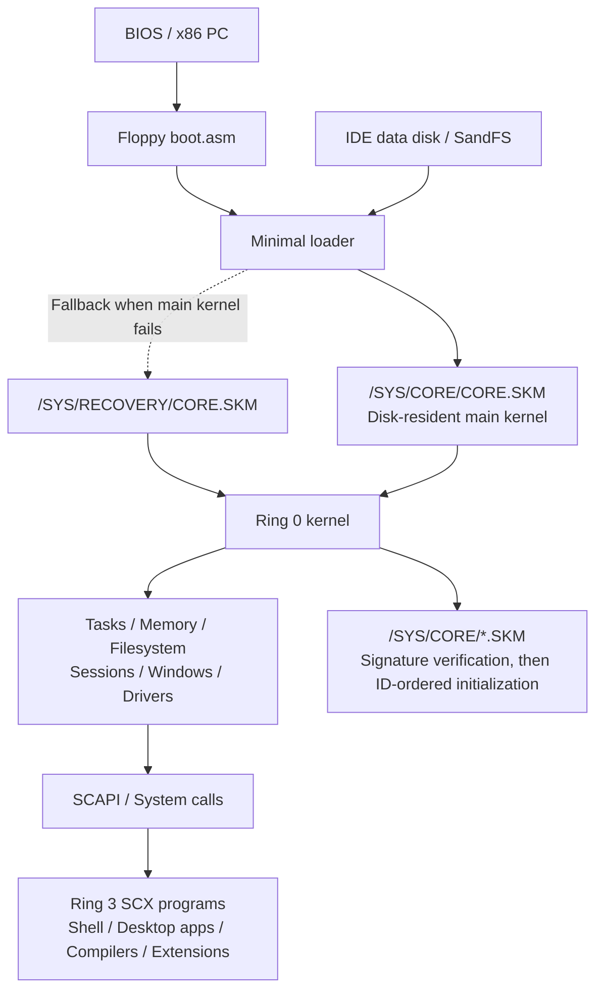

# SandCore

[简体中文](README.md) | **English**

> **Documentation language:** This is the English translation of the main project README. The other project documentation, including technical specifications, build and usage guides, verification records, and milestone histories, has **not yet been translated into English**. Links below therefore generally lead to Chinese-language documents.

**A 32-bit x86 operating system spanning the bootloader, kernel, desktop environment, and native development tools.**

SandCore is developed by [mio](https://github.com/mio-qwq/). The project includes BIOS boot support, paging and preemptive multitasking, the SandFS filesystem, a multi-user desktop, graphical applications, audio, IPv4 networking, custom executable formats, and an in-system C compiler, assembler, and debugger capable of compiling and running programs within SandCore itself.

The current development version is **M10a1**, accepted on **October 7, 2026**. Under the latest release decision, M10a1 is distributed as a **GitHub Preview pre-release** of M10a, with subsequent development consolidated on `main`. M9 is the accepted stable release; source code and runnable images for M8a and earlier versions are retained. The full M10 milestone has not been declared complete, and the base kernel has not yet been frozen.

| Entry point | Description |
|---|---|
| [Current development acceptance](sandcore/docs/M10A1-ACCEPTANCE.md) | M10a1 features, usage, actual verification evidence, and limitations |
| [Download M10a1 Preview](https://github.com/mio-qwq/SandCore/releases/tag/M10a1) | Accepted development build; [release notes](sandcore/docs/M10A1-PREVIEW.md) |
| [Building and running](#building-and-running) | Build the current system from source or launch an existing version |
| [Architecture](#system-architecture) | Boot sequence, kernel, user space, sessions, and extensions |
| [Repository layout](#repository-layout) | Core project, extension packages, image editor, and historical archives |
| [Extension software packages](#extension-software-packages-ext) | Five applications, shared libraries, and a self-contained SCX installer |
| [SandFS image editor](#sandfs-image-editor) | Browse, import, export, and edit data-disk images on Windows |
| [Documentation index](#documentation-index) | Design, formats, tools, and acceptance documents organized by topic |
| [Historical releases](releases/README.md) | Compact runnable packages for M6 / M7 / M8a / M9 |

## Current Capabilities

| Area | Implemented scope |
|---|---|
| Boot and kernel | BIOS dual-disk boot, disk-resident main kernel, minimal loader, recovery image, and separate Ring 0 extensions |
| Memory and tasks | Physical-page and heap management, per-task address spaces, preemptive scheduling, event-based waiting, dynamic tasks and associated resources, exit and exception cleanup |
| Users and permissions | Kernel UID/GID, file read/write permissions, login sessions, per-session desktops, and independent focus and input |
| Graphical desktop | VGA fallback, native true color and multiple resolutions, Aurora / Classic themes, window management, desktop menus and shortcuts, and client-area screenshots |
| Text | Direct loading of original Vonwaon 12px / 16px TTF files, integer/fixed-point parsing and rasterization, on-demand glyph caching; Notes can display Chinese source-code comments |
| Storage | Custom SandFS with v5 permissions and object generations, dual directory banks, CRC, and copy-on-write transactions; 256 MiB M10a1 development disk with backward compatibility for older volumes |
| Audio | AC97 under Windows QEMU, system sounds, WAV / MP3 / FLAC playback, cover art, mini-player, and command-line entry points |
| Networking | e1000 under Windows QEMU, IPv4, Ethernet / ARP / ICMP / UDP / TCP, fragmentation and reassembly, routing, DHCP, DNS, and sockets |
| Command line | SandShell, pipes and redirection, jobs, standalone CLI utilities, a custom nano implementation, and network tools |
| Native development | S3C / SCCC C compilers, SandAsm assembler, graphical and CLI debugging, SCX packaging, and SKM extension development |
| Administration and debugging | External dual-serial-port SYSTEM administration and COM1 Ring 0 debugging; guest root is distinct from the external hardware administrator |
| Extension ecosystem | Standalone user-space library libex, a five-application software package, installation/uninstallation wizard, embedded icons, and configuration templates |
| Host tools | Windows SandFS image editor; build, image, and packaging tools; serial administration tools; historical rebuilding and verification scripts |

Removing the fixed multitasking limit is a key M10a1 improvement. Tasks, credentials, environments, debugging/SIMD state, and related sessions, windows, pipes, and other resources are allocated dynamically according to actual resource availability. The total count remains constrained by available memory and individual resource contracts. Allocation failures are reported explicitly and rolled back. See [M10-LIFECYCLE.md](sandcore/docs/M10-LIFECYCLE.md) for lifecycle details.

Built-in graphical applications include Files, Notes, Canvas, Lens, Settings, Monitor, IDE, and Debug. Built-in games, a general-purpose graphics library, and film projects are also preserved in the repository. The performance, visual-fidelity, and completed-film goals of the original full M8 milestone that were not achieved have been archived; see [M8-FROZEN.md](sandcore/docs/M8-FROZEN.md) for their exact scope.

### Network Tools and Scope

SandCore currently provides **19 standalone networking tools**:

```text
ip          ifconfig       ifup         ifdown       route
arp         arping         ping         traceroute   netstat
nslookup    hostname       dnsdomainname ipcalc       udhcpc
nc          wget           tftp         curl
```

`nc` supports `-e` for executing a program and connecting its standard streams. `wget` and the custom `curl` implementation support documented subsets of HTTP; `curl` includes common operations such as request methods, headers, uploads, redirects, and file output. See [CLI-M10.md](sandcore/docs/CLI-M10.md) for the exact options supported.

The original set of 18 tools corresponds to the retained 55-item network reference matrix; `curl` was added separately. M9 CLI comparisons likewise record the explicitly supported subset of behavior. Refer to the relevant matrices for command counts and functional scope. These utilities are independently written, standalone programs; BusyBox is used as a functional reference.

The current network device target is **e1000 / Intel 82540EM under Windows QEMU**, with interface name `en0`. Only IPv4 is supported in this milestone. HTTPS/TLS, IPv6, and a browser have not yet been implemented, and full compatibility with other network adapters or physical hardware is not claimed.

## System Architecture

### Boot Sequence and Disk-Resident Main Kernel



The system still uses two disks: a 1.44 MiB floppy image containing the boot code and minimal loader, and an IDE data disk containing SandFS, the main kernel, programs, fonts, configuration, and user data. Almost all kernel logic resides in `/SYS/CORE/CORE.SKM`. The loader is limited to essential read-only disk discovery, format/bounds and integrity checks, loading, handoff, and early diagnostics.

If the main kernel cannot be loaded, the loader attempts `/SYS/RECOVERY/CORE.SKM`. The recovery directory is separate from the boot-time extension directory. CRC/SHA-256 integrity checks for the main kernel and Ed25519 signature verification for extensions serve different purposes.

SKM2 extensions under `/SYS/CORE/` other than `CORE.SKM` must pass signature verification against the designated public key. They are then initialized once in ascending order of their unique, signed internal IDs. When IDs conflict, all extensions with the duplicated ID are rejected. Successfully registered services may remain resident until reboot. Hot unloading and hot reloading are not supported in this milestone. The legacy SKM1 administration path under `/SYS/MOD` remains available. See [CORE.md](sandcore/docs/CORE.md) and [MODULE.md](sandcore/docs/MODULE.md) for format details.

### Kernel Modules and the User-Space Boundary

| Layer | Main sources | Responsibilities |
|---|---|---|
| Boot and loading | `boot/boot.asm`, `boot/loader.c`, `kernel/core_entry.asm` | BIOS entry, minimal loader, main-kernel handoff |
| Memory and execution | `memory.*`, `heap.*`, `paging.*`, `task.*`, `task_store.*`, `process.*` | Pages and heap, address spaces, dynamic tasks, scheduling, and lifecycles |
| Identity and sessions | `auth.*`, `session.*`, `management.*` | UID/GID, credentials, login, session isolation, and external administration |
| Files and standard streams | `ata.*`, `fs.*`, `streams.*` | ATA, SandFS, transactions, endpoints, pipes, and jobs |
| Graphics and input | `gfx.*`, `display.*`, `wm.*`, `desktop.*`, `theme.*`, `ttf.*` | Display, compositing, windows, desktop, themes, and text; keyboard/mouse input is handled by the corresponding drivers |
| Audio and networking | `audio.*`, `e1000.*`, `network.*`, `net_socket.c`, `net_port/` | AC97, network adapter, lwIP adaptation, protocols, and socket lifecycles |
| Extensions and debugging | `module2.c`, `core_signature.*`, `serial.*`, `ringdebug.*`, `simd.*` | SKM, signature verification, dual serial ports, debugging, and extended-register state |
| User space | `user/`, `ext/` | Shell, applications, development tools, standalone utilities, and software packages |

The kernel is written in freestanding C and x86 assembly, without floating-point operations or libc. User programs access it through the custom system-call interface and [`SCAPI.H`](sandcore/user/SCAPI.H), typically using `start.asm`, a user-space linker script, and the SCX packaging pipeline. Published APIs and ABIs are additive-only: existing entry points and buffer layouts are preserved, while new capabilities use new calls or versioned snapshots.

NUI and the various `SC*.H` / `*.inc` headers and includes provide user-space facilities for native interfaces, memory, standard streams, networking, and related functions. S3C/SCCC can generate executable machine code inside the guest system. Host toolchains build the boot and bootstrap components as well as designated other components. Host-build results, in-system compilation results, and real execution evidence are documented separately.

### Sessions, Desktops, and Administration

Each login session has its own desktop, windows, focus, and input. The SYSTEM administration window is not shown by default on mio or root desktops. Hidden sessions are excluded from compositing and drawing, and built-in GUI applications stop producing hidden frames according to visibility. Background tasks such as networking, audio, and CLI programs continue running; returning to a session requests a redraw.

External dual-serial-port administration follows a hardware-debugging model: the QEMU host simulates a separate physically connected machine. Ordinary guest users and guest root cannot acquire SYSTEM administration privileges by connecting to their own serial ports. See [SESSION.md](sandcore/docs/SESSION.md), [AUTH.md](sandcore/docs/AUTH.md), and [SERIAL.md](sandcore/docs/SERIAL.md) for the exact session and permission contracts.

### Main Paths on the Data Disk

| Guest path | Purpose |
|---|---|
| `/SYS/CORE/CORE.SKM` | Main kernel |
| `/SYS/CORE/*.SKM` | Signature-authorized boot-time extensions |
| `/SYS/RECOVERY/CORE.SKM` | Independent recovery kernel |
| `/SYS/MOD/` | Legacy SKM1 administrative extensions, governed by the external SYSTEM permission chain |
| `/SYS/FONT/` | Original Vonwaon TTF files and related font assets |
| `/SYS/INC/`, `/SYS/SRC/` | Public headers and source files for in-system development |
| `/SYS/MAN/`, `/SYS/TEST/` | On-disk documentation and verification sources |
| `/SYS/LICENSE/` | Bundled third-party source code, complete licenses, copyrights, and provenance records |
| `/BIN/`, `/APPS/`, `/DESK/` | Commands, graphical applications, and desktop shortcuts |
| `/HOME/`, `/TMP/`, `/LEGACY/` | User files, temporary files, and compatibility archives |

## Repository Layout

The following tree shows the principal areas of the repository. Build outputs and local backups are addressed separately.

```text
projectos/
├── README.md                    Main project overview and navigation
├── README_EN.md                 English main README (this file)
├── LICENSE                      Limited source code license (English / Chinese)
├── DEVELOPMENT-LOG.md           Original root README; development and acceptance history
├── AGENTS.md                    Workspace engineering, compatibility, licensing, and process rules
├── HANDOFF.md                   Development handoff and internal status notes
├── AUDIT-NOTES.md               Historical review notes
├── M8_GOAL.md                   Original M8 goals
├── build.bat                    Current system build entry; defaults to M10a1
├── build-version.bat            Historical source-snapshot rebuild entry
├── run-m10a1.bat                Current development-acceptance runner
├── vonwaon-bitmap.ttf.zip        Original Vonwaon font archive
│
├── sandcore/                    Main operating-system project
│   ├── boot/                    BIOS boot code and minimal loader
│   ├── kernel/                  Kernel, drivers, filesystem, desktop, and syscalls
│   │   └── net_port/            SandCore platform port of lwIP
│   ├── user/                    Native user programs, public APIs, UI, and dev tools
│   │   ├── m9/                  Standalone CLI tools, nano, command-line development tools
│   │   ├── net/                 19 network utilities and shared HTTP/CLI code
│   │   ├── audio/               Player and audio decoding adapters
│   │   ├── codec/               Image decoding/service adapters
│   │   ├── compress/            DEFLATE and other compression adapters
│   │   └── pack/                bzip2 / LZMA and other archive components
│   ├── modules/                 Wallpaper-module source and signed extensions
│   │   └── signed/              Accepted public signed artifacts
│   ├── assets/                  Fonts, icons, wallpapers, sounds, configuration, etc.
│   │   ├── design/              Design references
│   │   ├── font/                Font-build inputs and cached assets
│   │   ├── trust/               Official verification public key and documentation
│   │   └── licenses/            Original resource-license texts
│   ├── third_party/             Pinned upstream sources, provenance, licenses, hash manifests
│   ├── legacy/                  Preserved historical programs and compatibility resources
│   ├── docs/                    Designs, formats, supported scope, acceptance, and history
│   ├── tests/                   Guest-side probes and targeted test sources
│   ├── tools/                   Build, image, signature-receipt, serial, and verification tools
│   ├── Makefile                 Main build rules
│   ├── m9.mk / m10.mk           Milestone build and resource integration
│   ├── core.ld / linker.ld      Main and historical kernel link layouts
│   └── build/                  Local images, generated files, and acceptance results (not uploaded)
│
├── ext/                         Standalone user-space extension ecosystem
│   ├── README.md                Extension workspace overview
│   ├── CONVENTIONS.md           Extension development and delivery conventions
│   ├── libex/                   Shared expression, CSV, configuration, audio, and UI helpers
│   ├── tools/                   Icon, payload, and SCX packaging tools
│   ├── SoftwarePack1/           First extension package
│   │   ├── pcalc/               Programmer's calculator
│   │   ├── sheet/               Spreadsheet
│   │   ├── hexed/               Hex editor
│   │   ├── blocks/              Falling-block game
│   │   ├── raider/              First-person shooter
│   │   ├── installer/           Installation/uninstallation wizard and frozen payloads
│   │   ├── common/              Shared identity and About pages
│   │   ├── icons/ / cfg/        Pixel icons and default configuration
│   │   ├── tests/ / tools/      Host regressions and package-specific scripts
│   │   ├── dist/                Official single-file SCX installer
│   │   └── build/               Local build output; some logs/previews retained in Git
│   └── SoftwarePack1-baseline-20261006/
│                               Original baseline and pre-signing acceptance artifacts
│
├── sanddata_editor/             Standalone C/Win32 SandFS image editor
│   ├── src/ / resources/        Source code, Win32 resources, and manifest
│   ├── docs/ / tests/           Screenshots and verification sources
│   ├── sanddata_editor.exe      Published M9 executable
│   ├── build.bat                Standalone editor build entry
│   └── build/                  Local M10a1 executable and intermediates (not uploaded)
│
├── snapshots/                   Historical source snapshots: M6a / M6 / M7 / M8a
├── releases/                    One runnable package each: M6 / M7 / M8a / M9
│   ├── MANIFEST.json            Package/file provenance, sizes, and hashes
│   └── SHA256SUMS.txt           Release-package checksums
└── history/                     Content-deduplicated historical sources and project inputs
    ├── INDEX.json               Original paths, stored paths, sizes, and hashes
    └── objects/                 Historical candidates, scripts, documents, and film assets
```

`backup/`, `backup-output/`, `rebuild-output/`, `temp_miotest/`, and the main project/editor `build/` directories contain local backups, experimental runs, or generated data and are excluded by `.gitignore`. The old local `sandcore.zip` at repository root is also not the current repository entry point. Official historical runnable packages remain under `releases/`, and the original font archive is preserved separately.

`snapshots/` and `history/` provide traceability. The active operating system is built from `sandcore/`, and the extension package from `ext/SoftwarePack1/`. Preserving historical candidates, unsuccessful approaches, and film inputs does not imply that they form part of the current product.

## Building and Running

### Environment

- Windows QEMU, installed by default at `C:\Program Files\qemu`. The runner prefers WHPX and falls back to TCG.
- WSL Ubuntu with GCC, GNU binutils, GNU make, NASM, Python 3, and Pillow for asset conversion.
- Windows Python 3 for graphical launch, serial tooling, and development-acceptance package entry points.
- Windows MinGW GCC / windres for the standalone image editor. The extension package has its own WSL build rules.

Most compilation takes place under WSL, while QEMU runs on Windows. **Building the M10a1 disk-resident main kernel requires the WSL ELF toolchain.** MinGW fallback instructions for older versions do not directly apply to the new main kernel. See [BUILD.md](sandcore/docs/BUILD.md) and [QEMU.md](sandcore/docs/QEMU.md) for dependencies and layouts.

### Building from the Current Sources

Open PowerShell at the repository root:

```powershell
.\build.bat
```

The default target is M10a1. Output goes to `sandcore/build/m10a1-work/` and includes `sandcore.img`, `sanddata.img`, symbol files, and the resource tree. An equivalent WSL command is `make -j4` from the `sandcore/` directory.

The build migrates an existing M9 source disk or the verified compact M9 baseline from the repository to a 256 MiB data disk. Explicit preservation/replacement rules protect existing outputs and the original user disk. Deleting the entire `build/` tree should not be treated as a routine build step; see [BUILD.md](sandcore/docs/BUILD.md).

By default, the root runner expects locally accepted images in `sandcore/build/m10a1/`. After a fresh clone and only the build above, explicitly provide the `m10a1-work` images and matching symbols:

```powershell
$repo = (Get-Location).Path
.\run-m10a1.bat --boot "$repo\sandcore\build\m10a1-work\sandcore.img" --data "$repo\sandcore\build\m10a1-work\sanddata.img" --core-symbols "$repo\sandcore\build\m10a1-work\core.sym"
```

The provenance of programs produced by the host build and programs compiled within the accepted system is recorded separately. A successful rebuild does not constitute a rerun of the complete runtime acceptance process.

### Launching Existing Packages

If the latest accepted M10a1 images are already available locally, run `run-m10a1.bat` from the repository root. New users can download `SandCore-M10a1-acceptance.zip` from [M10a1 Preview](https://github.com/mio-qwq/SandCore/releases/tag/M10a1), extract it completely, and run the BAT inside. See [M10A1-PREVIEW.md](sandcore/docs/M10A1-PREVIEW.md) for package hashes and release boundaries, and [M10A1-ACCEPTANCE.md](sandcore/docs/M10A1-ACCEPTANCE.md) for usage.

For historical baselines available directly from Git, extract the matching ZIP under [`releases/`](releases/README.md) and run its included BAT. M9 requires Windows QEMU and Python. Image/tool provenance and hashes are documented in [MANIFEST.json](releases/MANIFEST.json).

The M10a1 runner creates an independent session disk at each launch, and prints its directory in the terminal. Files, passwords, and settings are stored in the session's `sanddata.img`. To resume an existing session, pass `--data "absolute path to the previous session's sanddata.img"`. Shut down QEMU using that disk before editing it with the image editor.

### Logging In and Getting Online

Press `F12` in the guest to open the login interface. Root has no preset usable login password. Run `passwd root` through the external SYSTEM serial console, enter your chosen password at the hidden-input prompts, and then log in to root's separate desktop from the login screen. See [development acceptance](sandcore/docs/M10A1-ACCEPTANCE.md) for details.

Example guest-shell commands:

```sh
udhcpc -n -t 20
ip addr show
ping 10.0.2.2
curl -I http://example.com/
curl -L -o /TMP/PAGE http://example.com/
```

Public HTTP sites may redirect to HTTPS; the current tools explicitly report that HTTPS is unsupported. See [NETWORK.md](sandcore/docs/NETWORK.md) and [CLI-M10.md](sandcore/docs/CLI-M10.md) for supported behavior and configuration semantics.

### Rebuilding Historical Versions

```powershell
.\build-version.bat M6a
.\build-version.bat M6
.\build-version.bat M7
.\build-version.bat M8a
```

Historical sources are copied into separate `rebuild-output/<version>/` locations for building, leaving the original snapshots intact. M6a is an early source baseline. Host-side historical rebuilds and originally published native disk images have different byte-level provenance; see [snapshots/README.md](snapshots/README.md) and [REBUILD-VERIFICATION.md](sandcore/docs/REBUILD-VERIFICATION.md).

## Extension Software Packages (ext)

[`ext/`](ext/README.md) is an independent user-space extension ecosystem workspace, incorporating the complete existing M9 extension project. `libex/` and `tools/` are shared layers. Each `SoftwarePackN/` contains a package's applications, assets, installer, and dedicated documentation. Packages access system functionality through the existing SCAPI without introducing new kernel syscalls.

The first official package is **SandCore_ExtraSoftware_Pack_1**. Its final deliverable is:

[`ext/SoftwarePack1/dist/SandCore_ExtraSoftware_Pack_1.scx`](ext/SoftwarePack1/dist/SandCore_ExtraSoftware_Pack_1.scx)

| Application | Features |
|---|---|
| [PCalc](ext/SoftwarePack1/pcalc/README.md) | Integer expressions, variables, history, programmer's number bases, and on-screen keypad |
| [SandSheet](ext/SoftwarePack1/sheet/README.md) | 26 × 128 spreadsheet, formulas and range functions, CSV, inserting/deleting rows, and reference adjustment |
| [SandHex](ext/SoftwarePack1/hexed/README.md) | Hex/text editing, search, navigation, undo/redo, and file saving |
| [SandBlocks](ext/SoftwarePack1/blocks/README.md) | 7-bag falling blocks, Hold, landing-position hints, scoring, highscores, and sound effects |
| [SandRaider](ext/SoftwarePack1/raider/README.md) | Six-level first-person shooter with weapons, enemies, keys, exploration maps, and settings |

The installer embeds the applications, icons, and configuration, providing component selection, a custom installation directory, shortcut/configuration toggles, progress and result screens, and an uninstall entry point. The default install location is `HOME/APPS`, writable by ordinary users; updates preserve existing configuration. Each application and the installer have a consistent About page, author information, and copyright credits.

Use the SandFS image editor to place the SCX on the data disk, then run it from the guest shell:

```sh
run HOME/SandCore_ExtraSoftware_Pack_1.scx
```

Build from `ext/SoftwarePack1/` under WSL:

```sh
env -u OS make -j4
```

The package targets M9. Its core functionality was recorded as fully accepted on October 6, 2026. Subsequent attribution/About work also has a freestanding build, 442 host-side regression checks, and package-format checks; no additional guest boot was performed for that work. The existing project and deliverables were incorporated without claiming new M10a1 compatibility testing. See [RELEASE.md](ext/SoftwarePack1/RELEASE.md) and [TESTING.md](ext/SoftwarePack1/TESTING.md) for provenance and limitations.

The shared libraries provide expression evaluation, CSV, configuration, UTF-8, integer utilities, audio wrappers, and additional NUI controls; see [LIBEX.md](ext/libex/LIBEX.md). The original baseline and pre-signing acceptance artifacts are retained in `ext/SoftwarePack1-baseline-20261006/`. Local intermediate outputs remain preserved outside Git; regenerable object files, host test executables, and raw PPM images are excluded, while selected existing logs and PNG previews are retained.

## SandFS Image Editor

[`sanddata_editor/`](sanddata_editor/README.md) is a standalone C/Win32 host utility for manipulating `sanddata.img` in an interface similar to an archive manager.

- Browse directories, select multiple items, import files or folders, drag files out into Windows Explorer, and copy/export files.
- Delete, rename, create directories, save, and Save As; overwriting a file creates a backup in the same directory first.
- Support historical SandFS v1 through v5 while preserving disk capacity, UID/GID, permissions, and unchanged object generations.
- Detect external changes to the source disk before saving. The editor uses its Windows filesystem permissions and does not emulate guest-login permissions.

**Distinguish the version-specific entry points:** [`sanddata_editor.exe`](sanddata_editor/sanddata_editor.exe) in the repository is the preserved M9 release executable. Current sources support M10a1's 256 MiB volumes. Run the following command to create `sanddata_editor/build/m10a1/sanddata_editor.exe`; the M10a1 acceptance package also includes that newer version.

```powershell
.\sanddata_editor\build.bat
```

See [M10A1-ACCEPTANCE.md](sandcore/docs/M10A1-ACCEPTANCE.md) for existing evidence regarding the larger capacity, preservation of original objects, and drag-out protocol. See the [image editor README](sanddata_editor/README.md) for usage.


## Toolchain and Development Entry Points

| Tool or entry point | Purpose |
|---|---|
| `build.bat`, `sandcore/Makefile`, `m10.mk` | Build the current main kernel, loader, user programs, and data disk |
| `tools/mkimg.py`, `mkfs.py`, `mkfs_m9.py`, `mkfs_m10.py` | Boot-image packaging, SandFS creation, permission-aware volumes, and M10 migration |
| `tools/mkscx.py`, `mkskm.py`, `mkcore.py`, `mkext.py` | SCX, legacy SKM, main-kernel, and signed extension-body packaging |
| `tools/mkcore_public_key.py`, `core_signature.py`, `receive_m10_signatures.py` | Public-key integration, public-result signature verification, and signature receipt |
| `tools/user_sign_m10.py` and root signing BAT | Offline signing UI to be operated only by the key holder; the BAT uses locally configured Python |
| `tools/scserial.py`, `serial_protocol.py` | External SYSTEM administration, dual serial communication, and debug protocol |
| `tools/run_m10a1.py`, `qemu_config.py` | Windowed launching, independent sessions, QEMU configuration, and acceleration |
| `tools/publish_native.py`, `publish_m8_native.py` | Provenance checks and disk publication of historically in-system-compiled artifacts |
| `tools/rebuild_version.py`, `published_baseline.py` | Independent historical rebuild and verified baseline retrieval |
| `tools/package_m10a1.py`, `package_m9_acceptance.py`, etc. | Acceptance-package and historical-release packaging, including provenance |
| `tools/audit_*.py`, `verify_*.py`, `tests/` | API, format, compatibility, guest behavior, and asset checks; select based on actual changes |
| `tools/snap.py`, `keys.py`, `mouse.py` | HMP input and real guest screenshots |

Paths beginning with `tools/` in the table above are relative to `sandcore/`. The extension ecosystem also has `ext/tools/` for icons, payloads, and SCX packaging, plus package-specific scripts under `SoftwarePack1/tools/`.

Changes to the kernel, drivers, formats, and system calls must be accompanied by updates to the corresponding specifications. `SCAPI.H` is authoritative for the user-program interface. Verification uses Windows QEMU, actual guest inputs, and screenshots, retaining valid historical evidence and selecting checks based on the risks introduced by changes. See [AGENTS.md](AGENTS.md) for detailed rules and acceptance reports for actual milestone results.

## Documentation Index

Some specifications retain earlier headings or statements such as "not yet verified" from past phases. For current version status, consult the acceptance documents first, then the revision histories. The index below groups documents by topic.

**Language reminder:** The linked documents listed below have not yet been translated into English and are generally written in Chinese.

### Current Version, Plans, and Acceptance

| Document | Content |
|---|---|
| [M10A1-ACCEPTANCE](sandcore/docs/M10A1-ACCEPTANCE.md) | Acceptance, startup, features, and limitations of the current development version |
| [M10A1-PREVIEW](sandcore/docs/M10A1-PREVIEW.md) | Preview download, package hashes, and release provenance |
| [M10A1-DESIGN](sandcore/docs/M10A1-DESIGN.md) | Approved complete development contract |
| [M10A1-IMPLEMENTATION](sandcore/docs/M10A1-IMPLEMENTATION.md) | Implementation and intermediate statuses |
| [M10A1-READINESS](sandcore/docs/M10A1-READINESS.md) | Completeness checks and verification entry points |
| [M10A1-VERIFICATION](sandcore/docs/M10A1-VERIFICATION.md) | Actual build/run results, failures, and fixes |
| [M10-LIFECYCLE](sandcore/docs/M10-LIFECYCLE.md) | Dynamic tasks and related resource lifecycles |
| [ROADMAP](sandcore/docs/ROADMAP.md), [M9/M10 roadmap notes](sandcore/docs/SandCore_M9_M10_Roadmap.md) | Milestone plans and ABI/bootstrap direction |

### Boot, Kernel, Storage, and Security Boundaries

| Document | Content |
|---|---|
| [BOOT](sandcore/docs/BOOT.md), [CORE](sandcore/docs/CORE.md) | BIOS boot, main-kernel format, recovery, and signed extensions |
| [MODULE](sandcore/docs/MODULE.md) | Legacy SKM1 Ring 0 modules and ABI |
| [INTR](sandcore/docs/INTR.md), [MEM](sandcore/docs/MEM.md) | Interrupts, memory, and paging |
| [FS](sandcore/docs/FS.md), [STORAGE](sandcore/docs/STORAGE.md) | SandFS format, transactions, and disk information |
| [AUTH](sandcore/docs/AUTH.md), [SESSION](sandcore/docs/SESSION.md) | Identity, credentials, login, and session desktops |
| [SERIAL](sandcore/docs/SERIAL.md) | External dual-serial administration and debugging |
| [STREAMS](sandcore/docs/STREAMS.md), [SYSCALL](sandcore/docs/SYSCALL.md) | Byte streams, pipes, jobs, and system calls |
| [CPU](sandcore/docs/CPU.md), [SIMD](sandcore/docs/SIMD.md) | CPU capabilities, integer SSE2, and state preservation |

### Graphics, Fonts, Audio, and Networking

| Document | Content |
|---|---|
| [GFX](sandcore/docs/GFX.md), [WM](sandcore/docs/WM.md) | Palette, rendering, and window system |
| [THEME](sandcore/docs/THEME.md), [FONT](sandcore/docs/FONT.md) | Themes, Vonwaon TTF, and text ABI |
| [IMAGE](sandcore/docs/IMAGE.md), [IMAGE-SERVICE](sandcore/docs/IMAGE-SERVICE.md) | Image formats, decoding services, and client interfaces |
| [AUDIO](sandcore/docs/AUDIO.md), [CAPTURE](sandcore/docs/CAPTURE.md) | Audio and specific-window screenshots |
| [NETWORK](sandcore/docs/NETWORK.md), [CLI-M10](sandcore/docs/CLI-M10.md) | e1000, IPv4, sockets, and utility behavior |
| [M10 network reference matrix](sandcore/docs/M10-CLI-MATRIX.tsv), [extra utility matrix](sandcore/docs/M10-EXTRA-CLI-MATRIX.tsv) | Original 55 reference items and the separately tracked curl addition |

### User Space, Compilers, and Command Line

| Document | Content |
|---|---|
| [USERSPACE](sandcore/docs/USERSPACE.md), [APPS](sandcore/docs/APPS.md) | User programs, SCX, and application entry points |
| [SHELL](sandcore/docs/SHELL.md), [CLI-M9](sandcore/docs/CLI-M9.md) | Shell and standalone CLI utilities |
| [C](sandcore/docs/C.md), [ASM](sandcore/docs/ASM.md) | SCCC/S3C and SandAsm |
| [DEBUGGER](sandcore/docs/DEBUGGER.md), [SCDBG-CLI](sandcore/docs/SCDBG-CLI.md) | Graphical and command-line debugger |
| [NANO-M9](sandcore/docs/NANO-M9.md), [AWK-M9](sandcore/docs/AWK-M9.md) | Custom nano and awk subset |
| [M9 CLI matrix](sandcore/docs/M9-CLI-MATRIX.tsv), [behavior records](sandcore/docs/M9-CLI-BEHAVIOR.json) | Full reference items, supported behavior, gaps, and evidence |

### Applications and Shared Libraries

| Document | Content |
|---|---|
| [FILES](sandcore/docs/FILES.md), [NOTES](sandcore/docs/NOTES.md) | File management and text editing |
| [CANVAS](sandcore/docs/CANVAS.md), [LENS](sandcore/docs/LENS.md) | Drawing and image viewing |
| [CONFIG](sandcore/docs/CONFIG.md), [STUDIO](sandcore/docs/STUDIO.md) | Settings and graphical editing/in-system compilation |
| [MONITOR](sandcore/docs/MONITOR.md), [WELCOME](sandcore/docs/WELCOME.md) | Monitoring and welcome program |
| [SCMEM](sandcore/docs/SCMEM.md), [SCWIDE](sandcore/docs/SCWIDE.md) | Batched memory primitives and paired 32-bit arithmetic |
| [SCENE](sandcore/docs/SCENE.md), [SCVOX](sandcore/docs/SCVOX.md) | Shared scene and voxel-query sources |
| [Extension overview](ext/README.md), [conventions](ext/CONVENTIONS.md), [libex](ext/libex/LIBEX.md) | Extension layering, development rules, and shared libraries |
| [Package overview](ext/SoftwarePack1/README.md), [build](ext/SoftwarePack1/BUILD.md), [release](ext/SoftwarePack1/RELEASE.md), [tests](ext/SoftwarePack1/TESTING.md) | Usage and delivery records for the first extension package |
| [Image editor](sanddata_editor/README.md) | Windows tool usage and version entry points |

### Building, Verification, Packaging, and Provenance

| Document | Content |
|---|---|
| [BUILD](sandcore/docs/BUILD.md), [QEMU](sandcore/docs/QEMU.md) | Toolchain, build rules, and Windows QEMU |
| [TESTING](sandcore/docs/TESTING.md), [PERFORMANCE](sandcore/docs/PERFORMANCE.md) | Verification methods, performance measurements, and observed boundaries |
| [PACKAGE](sandcore/docs/PACKAGE.md), [REBUILD-VERIFICATION](sandcore/docs/REBUILD-VERIFICATION.md) | Historical packaging rules and source rebuild evidence |
| [SOURCE-BACKUP](sandcore/docs/SOURCE-BACKUP.md), [history](history/README.md) | Preservation scope, content deduplication, and provenance |
| [THIRD-PARTY](sandcore/docs/THIRD-PARTY.md) | Third-party sources, fonts, and licensing records |
| [Historical snapshots](snapshots/README.md), [runnable packages](releases/README.md) | Source snapshots and compact dual-disk packages for past versions |
| [Development log](DEVELOPMENT-LOG.md), [handoff notes](HANDOFF.md), [audit notes](AUDIT-NOTES.md) | Internal processes and historical statuses |

### M9 and Earlier Versions

| Document | Content |
|---|---|
| [M9-RELEASE](sandcore/docs/M9-RELEASE.md), [M9-ACCEPTANCE](sandcore/docs/M9-ACCEPTANCE.md) | M9 stable release and acceptance |
| [M9-DESIGN](sandcore/docs/M9-DESIGN.md), [M9-IMPLEMENTATION](sandcore/docs/M9-IMPLEMENTATION.md), [M9-VERIFICATION](sandcore/docs/M9-VERIFICATION.md) | M9 plans, implementation, and run history |
| [M8A-RELEASE](sandcore/docs/M8A-RELEASE.md), [M8-FROZEN](sandcore/docs/M8-FROZEN.md), [M8-RETROSPECTIVE](sandcore/docs/M8-RETROSPECTIVE.md) | M8a release, original M8 freeze, and retrospective |
| [M8](sandcore/docs/M8.md), [M8-DESIGN](sandcore/docs/M8-DESIGN.md), [M8-COMPONENTS](sandcore/docs/M8-COMPONENTS.md) | Original M8 plan, design, and component list |
| [M8-IMPLEMENTATION](sandcore/docs/M8-IMPLEMENTATION.md), [M8-PHASE2](sandcore/docs/M8-PHASE2.md), [M8-GAMES](sandcore/docs/M8-GAMES.md) | Original M8 phase execution, evidence, and game requirements |
| [GAMES](sandcore/docs/GAMES.md) | Game prototypes and historical scope |
| [FILM](sandcore/docs/FILM.md), [FILM-STORYBOARD](sandcore/docs/FILM-STORYBOARD.md), [MATH-FILM](sandcore/docs/MATH-FILM.md) | Archived film/player goals, storyboards, and host-rendering work |
| [M6A](sandcore/docs/M6A.md), [M6](sandcore/docs/M6.md), [M7](sandcore/docs/M7.md) | Historical milestone acceptance |
| [M8_GOAL](M8_GOAL.md) | Original full M8 goals |

## Source Code, Licensing, and Release Status

The bootloader, kernel, filesystem, desktop, compilers, and tools are principally written by this project. The networking stack and selected image/audio decoding and compression components use pinned third-party implementations. Third-party sources, original copyright and license texts, provenance, and adaptation records are retained together and collected in `/SYS/LICENSE/` inside the guest.

Major third-party components include lwIP, Monocypher, stb_image, libwebp, dr_mp3, dr_flac, miniz, libbzip2, and the LZMA SDK decoder. The font is Vonwaon Bitmap. The exact license choices, embedded upstream implementations, and per-file provenance are documented in [THIRD-PARTY.md](sandcore/docs/THIRD-PARTY.md) and the corresponding original licenses.

**Licensing:** The repository has a root [limited source code license](LICENSE) for project-owned materials, allowing personal, non-commercial learning and research under its stated conditions. It is a **source-available, restricted-license project**, not an OSI-approved open-source release. Third-party components remain governed by their own licenses. Resource provenance statements do not, by themselves, establish or invent permissions for user-supplied assets.

The official Ed25519 private signing key is retained exclusively by its owner. The repository accepts only the public key and public signature results; development agents must not generate, access, store, or substitute the private key. See [CORE.md](sandcore/docs/CORE.md) for the signing process.

| Version | Status |
|---|---|
| M10a1 | Accepted on October 7, 2026; GitHub Preview pre-release, including the separately added curl; development unified on main |
| M9 | Accepted on October 5, 2026; stable release |
| M8a | Approved partial stable release; unfinished goals of the original M8 remain archived |
| M7 / M6 | Delivered runnable packages and historical source code preserved |
| M6a | Early source baseline and rebuild entry retained |

This repository documents source code, existing runnable packages, and verification evidence separately. Features not yet implemented—such as a browser, IPv6, TLS, GPU drivers, SMP, and an input method—are not retroactively considered complete merely because the current milestone was accepted. The same applies to the unfinished original M8 goals.

---

Revision (2026-10-07): Established the main project README and renamed the original root README as the development-stage log; incorporated the existing extension workspace, deliverables, and baselines; completed the architecture, directory, image-editor, tooling, and documentation index.

Revision (2026-10-07): Published M10a1 Preview under the latest authorization; documented the accepted ZIP and download link; consolidated existing branches into `main`.

Translation note (2026-10-08): Added this English main README. Technical content follows the Chinese README; the licensing paragraph reflects the root `LICENSE` file already present. Other documentation remains untranslated.
