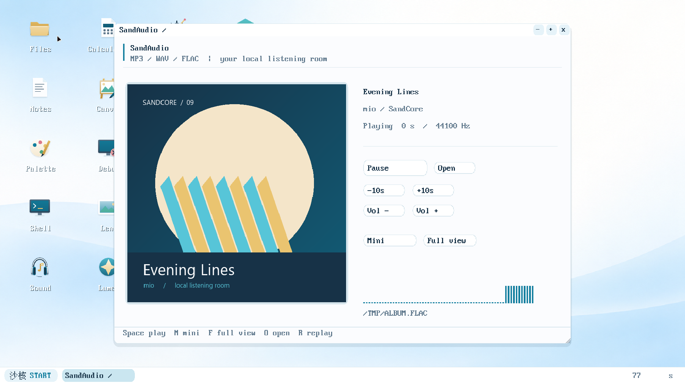
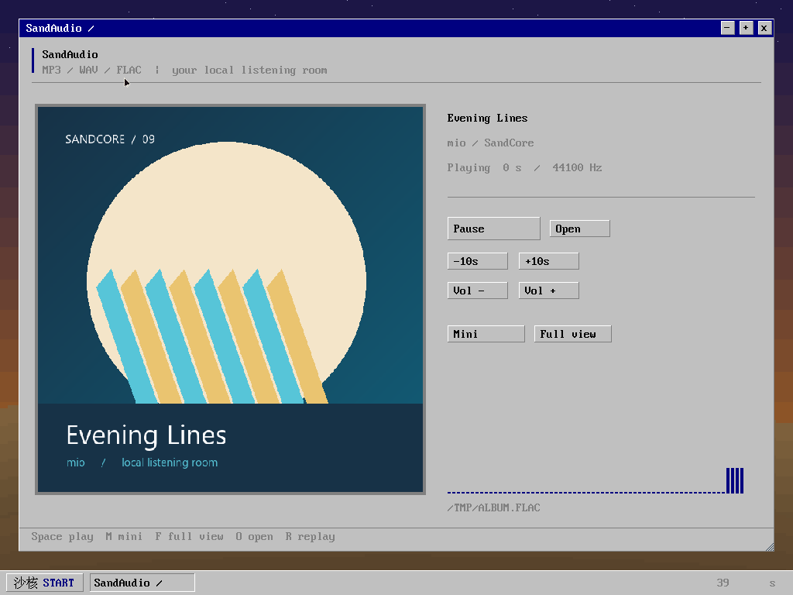
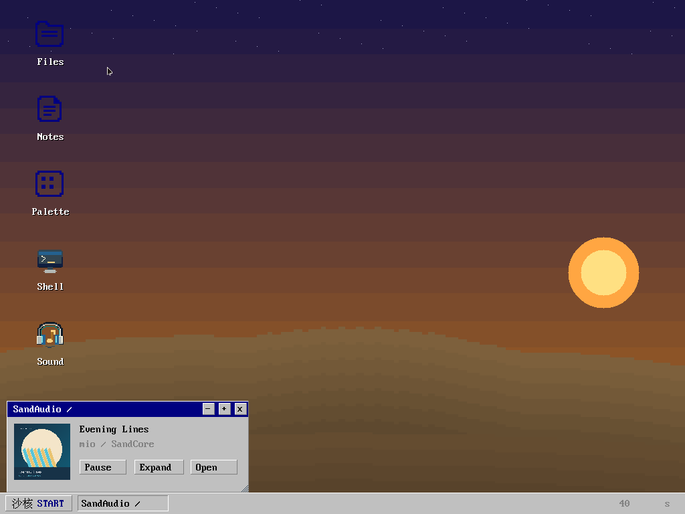

# M9 验收包（2026-10-05）

本轮约定功能已构建并完成Windows QEMU验证，状态为**待用户验收**。
用户已明确按M9本地功能范围验收；完整BusyBox对照表310行保留。
140/171个本地参考命令（81.9%）都有两个来源盘的实际行为证据，
仅承诺各工具公开支持的子集；31个本地缺项、网络55项、平台专有82项、
用户排除2项继续列明，不宣称BusyBox全部选项兼容。

## 交付与运行

独立入口：`../temp miotest/run-m9-acceptance.bat`。
独立目录：`../temp miotest/M9-ACCEPTANCE/`；压缩包：
`build/SandCore-M9-acceptance-2026-10-05.zip`。
原M9/M9-FLAC镜像、用户已有会话和源文件保留。新包每次复制基线或自己的
上次会话到新目录，`:quit`正常退出；`--fresh`从新包基线重新开始。
新版不会自动接管旧试玩会话。需要Windows QEMU与Python 3.12；编译复现
使用GitHub仓库内源码、字体及精简M7/M8a基线，不再依赖本机原大ZIP，
另需WSL GCC/NASM等宿主工具，见[干净构建记录](REBUILD-VERIFICATION.md)。不交付FFmpeg宿主程序。

开机可直接使用串口SYSTEM Shell；`nano`编辑，`s3c`/`sccc`编译，
`sandasm`汇编，`scdbg`调试三环，`skmrun`/`insmod`执行一次性/常驻SKM。
`:debug`切COM1，`hello`/`halt`/`regs`/`mem`/`step`/`cont`操作真实零环现场；
`:management`返回管理通道。`:put 本机文件 客体路径`、`:get 客体路径 本机新文件`
均显示进度并校验SHA256。密码提示出现后用`:secret`不回显输入；nano用
`:raw`逐键输入，Ctrl-]回宿主菜单。

播放器示例：`/APPS/SOUND.SCX /TMP/ALBUM.FLAC &`。M切换左下角迷你/
恢复大屏，F最大化，空格暂停，R重播，O选曲；两主题Shell沿用原图标。
示例FLAC为1.25秒原创测试音。`capture`列窗口，`capture 句柄 /TMP/WINDOW.BMP`
保存完整客户区，再用`:get`取回；可先在客体gzip无损压缩以缩短串口传输。

## 实际证据

所有VM均使用Windows QEMU、独立测试副本、两个外部UART与无网络设备配置；
源盘启动前后核对摘要。HMP sendkey驱动实际按键，screendump保存真实画面。
下表是各批次实际用例行数，存在重叠，不累计冒充互不重复的功能数量。

| 范围 | 结果 | 原工作区证据 |
|---|---|---|
| Shell/基础CLI/nano/scdbg | 双盘128项PASS | build/m9-final-cli-core-20261005-02/matrix.json |
| CLI文件/文本/进程/参数/cron/log扩展 | 双盘256项PASS | build/m9-cli-behavior-20261005-03/matrix.json |
| nano 4MiB/超限/行数/NUL与scdbg背压/EOF | 双盘34项PASS，8016B输入完整、页数回基线 | build/m9-cli-limits-20261005-01/matrix.json |
| 登录/改密/UID与模块边界/页回收/真实CPL0 UD2 | 双盘118项PASS，fatal明确拒绝恢复 | build/m9-security-extra-20261005-07/matrix.json |
| 串口重复帧/BYE/真实30秒租约/重连及截图8槽/护栏/异常退出 | 双盘50项PASS，页数严格回基线 | build/m9-session-lifecycle-20261005-02/matrix.json |
| SandFS真实事务硬终止/冷启动 | 8次硬终止+8次冷启动，54项PASS | build/m9-powercut-20261005-02/matrix.json |
| 数据/目录/超级块/FLUSH真实块层EIO与冷启动 | 16次QEMU，66项PASS，超级块不明提交冻结后续写入 | build/m9-iofault-20261005-03/matrix.json |
| SandFS CRC/结构/容量损坏 | 26次QEMU，136项PASS | build/m9-fs-20261005-05/matrix.json |
| SandAsm SSE2编码 | 每盘245种形式与GNU as全部字节相同；6类非法形式保留旧输出 | build/m9-sse-encoding-20261005-01/matrix.json |
| SCCC纯CLI真实自举与独立执行 | 双盘18项PASS，G2/G3固定点及实际SKM/ABI/流/SSE2 | build/m9-verify-20261005-19/matrix.json |
| 扩展现场/CPU与设备回退 | 双盘8种配置共68项PASS | build/m9-fallbacks-20261005-01/matrix.json |
| WAV各率/位深/声道/float/extensible/坏RIFF | 双盘80项PASS，25个有效与11个无效容器，全部PCM参考/页回收 | build/m9-audio-matrix-20261005-01/matrix.json |
| 外部编码MP3/CBR/VBR/mono/joint stereo | 双盘34项PASS，473920个S16样本与FFmpeg对照，最大差1 LSB | build/m9-mp3-oracle-20261005-02/matrix.json |
| FLAC/封面/迷你/恢复/选曲/两主题/串口完整像素 | 最终双盘92项PASS，另禁FPU双盘20项PASS | build/m9-player-20261005-09/matrix.json；m9-player-nofpu-20261005-01/matrix.json |
| 开关机及六音效 | 两盘有/无AC97，共4VM、16段实际连续波形及真实关机通过 | build/m9-sound-20261005-03/matrix.json |
| 新宿主工具PUT/GET进度 | 17项PASS，64KiB/空文件、SHA、旧文件保护、失败清理 | build/m9-progress-20261005-02/verification.json |
| 当前源码/构建/格式/许可/旧ABI | 164 ELF无未解析符号/动态TLS，内核213240B、BSS末端0x1ca194；两盘208/195个SCX及225份来源归档通过；M7/M8a API和原版字节保留 | build/m9-build-integrity-08.json；m9-compat-static-08.json |
| 原版历史程序实际执行 | 双盘54项身份/GUI/原M7探针，UD2/INT3/TF/字体/指针/窗口回收 | build/m9-verify-20261005-20/matrix.json |

140项命令到每条双盘PASS的映射为[机器可读行为表](M9-CLI-BEHAVIOR.json)，
完整[310行对照表](M9-CLI-MATRIX.tsv)仍保留。适用性是用户已选范围，
选项和格式差异见[CLI规范](CLI-M9.md)，不能用81.9%掩盖这些限制。

最终内核SHA256为d279523c76d6431fac1b0baecb5dd09cf5d5b24d68d1bb07c973077fe6939202。build30只追加完整桌面回退修复与新版CORE构建接线；最终双盘重新执行传输、原生编译/扩展现场/音频、身份、零环、窗口和旧程序，共92项通过。build31仅CORE.SKM绘图合并同色区段，内核/CLI字节不变，逐像素与实际连续生命周期另验；独立坏盘/EIO/硬终止、账户/租约等专项保留各自实际构建摘要，不改称在最终内核全部重跑。所有原失败记录保留。

最终图形回归逐行核对迷你窗口外整个工作区，两个分辨率/主题通过；最后CORE版又在每盘连续20次主题切换/启动/大屏封面/迷你桌面恢复/退出及页回收中通过，总82条用例、40个真实生命周期，串口心跳保持。08曾有一次心跳超时，根因未证实，09和最终连续批次未复现，不称已定位该超时。另实际跑新CORE、原M7 CORE、缺CORE三种回退，关闭后完整工作区原像素恢复，VGA 64000像素与旧内核逐字节一致。证据：build/m9-desktop-fallback-20261005-02/matrix.json、build/m9-player-stress-20261005-02/matrix.json。

## 本轮实际修复

| 问题 | 修复和证据 |
|---|---|
| logger/logread从非HOME目录误解旧HOME返回值 | 将旧卷根相对HOME显式加根前缀；SCAPI语义不改，双盘扩展行为通过 |
| crontab默认HOME路径同样依赖当前目录 | 默认HOME固定卷根；显式crond -c继续按调用者目录解析 |
| Shell的~展开缺根前缀 | 从其它目录展开/进入~实际返回/SYS，双盘通过 |
| od -An多输出空地址行 | 无地址模式不输出结束地址/额外空行，二进制精确字节通过 |
| 原生桌面回退只画320×200，留下旧窗口 | 原生基底完整覆盖；默认CORE构建接线补齐动态尺寸，缺CORE用完整兜底，旧模块服务坐标/ABI不改；逐行工作区与VGA旧像素通过 |
| id忽略-u/-g参数 | 保留无参数旧输出，正确选择UID/GID、当前用户名；冲突/未知/组名选项明确失败，真实普通UID和SYSTEM通过 |

测试夹具另修512 token脚本分批、无LF命令标记、blkdebug规则iotype、
非管理员密码检查、单声道FFmpeg重混音口径，以及CPL0异常时独立COM2
请求线程。对应失败记录都保留；未为测试放宽权限、容量或调试恢复规则。

## 实测效率和证据边界

全尺寸1920×1080/150%与1024×768/100%，最终构建分别测得：

- 四状态单核心CPU 3.52%, 32.03%, 4.69%, 6.64%；串口中位148.0ms/P95 219.0ms。
- 四状态单核心CPU 6.25%, 35.94%, 10.55%, 7.42%；串口中位109.5ms/P95 281.0ms。

四状态依次为桌面空闲、实际播放、暂停大屏、暂停迷你。各4秒（播放2秒），PIT/墙钟、宿主CPU、WM提交、DMA完成、欠载与页数独立记录；退出页数严格回基线。CORE同色区段优化前后两个盘只有CORE.SKM正文变化，完整工作区像素分别覆盖1920×1032及1024×736并全部相同；同脚本观察空闲单核心CPU从7.42%/11.33%降为3.52%/6.25%，仅代表本机短采样，不扩为全组件性能保证。证据：build/m9-core-equivalence-01.json、build/m9-performance-20261005-02/matrix.json与03/matrix.json。修复前01画面有漏检，不作为最终视觉通过证据。

PUT/GET测速来自QEMU管道，不能当真实115200物理UART速率。音效使用
QEMU原生音频捕获，未声称做过本机扬声器主观听感验收。真实机器的串口、
声卡、物理扇区撕裂和设备热拔故障仍需硬件适配时测试；本轮目标明确为
Windows QEMU。网络/GPU/M10内核最终冻结均不提前加入本版本。

第三方产品代码仅选宽松许可并保留完整来源/版权/原文及源码于/SYS/LICENSE，
七个直接代码组件与225份固定归档均校验。FFmpeg/GNU as仅为宿主独立参考工具，
没有链接或复制进产品。不同解码器的1 LSB舍入差异公开保留，不改PCM来伪造相等。

修订：2026-10-05，记录已确认本地口径、所有实际专项、修复、效率、完整缺项及待用户验收状态；历史成果和失败证据保留。
修订：2026-10-05，同步仓库内基线复现入口；五版干净源码构建及M9串口/客体编译执行证据已上传，仍待用户验收。

## 最终实际画面

两主题/两分辨率连续回归保存的实际QEMU画面；未使用界面原型。

修订：2026-10-05，补最后CORE版本实际两主题大屏/迷你截图作为可携带验收证据。
